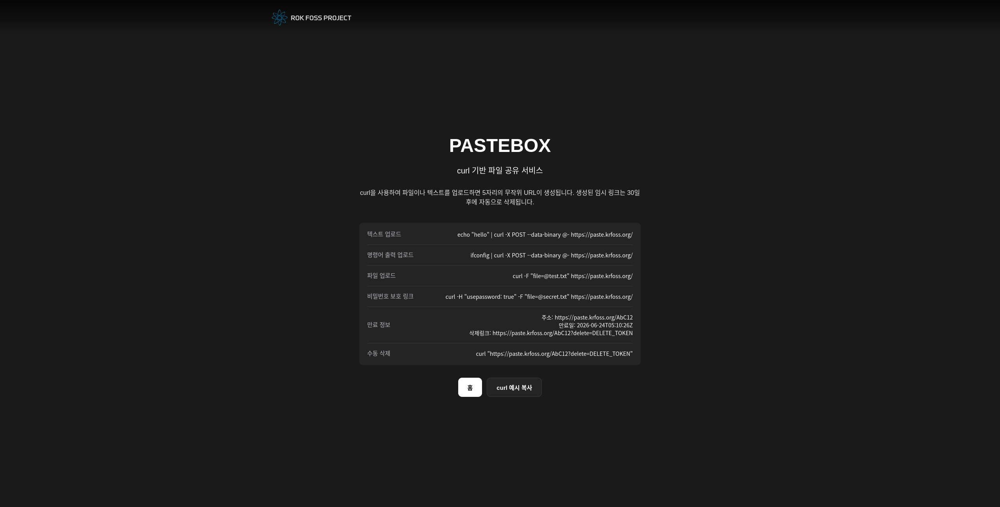

# Pastebox
curl-based file sharing service

English | [Korean](./README_ko.md)



### Tech stack
| Layer | Stack |
|--------|------|
| OS | Alpine Linux 3.23.4 (mirror: https://mirror5.krfoss.org/alpine) |
| Language | Go |
| Frontend | Go HTML Template |
| Backend | Go Standard Library HTTP Server |
| Storage | Local File Storage / MariaDB (Selective) |
| Compression | zstd / gzip (Available in DB Mode) |

*If there is a specific mirror you want to use, you can modify it in the Dockerfile.*

### How to use?
1. Clone the repository or download it as a .zip file.
2. Copy `config.example.conf` to create a `config.conf` configuration file.
   ```bash
   cp config.example.conf config.conf
   ```
3. Open and modify `config.conf` to choose whether to use simple local file storage or activate MariaDB for large-scale production.
4. Run locally:
   ```bash
   go build -o pastebox ./cmd/server
   ./pastebox
   ```
   *(Or run using docker compose if preferred: `docker compose up -d --build`)*
5. Access `http://localhost:8080` in your browser, or upload files using `curl`.

---

### Configuration Guide (`config.conf`)
Pastebox supports a simple `key=value` property-style `.conf` file to dynamically toggle between local file storage and database storage mode.

```ini
# Storage Mode (local: saves on local disk, db: connects to MariaDB/MySQL)
STORAGE_MODE=local

# Server binding address
LISTEN_ADDR=:8080

# [Local Mode Only] Physical path to store uploaded files
DATA_DIR=./data

# Auto-expiration days for temporary pastes
EXPIRE_DAYS=30

# [DB Mode Only] MariaDB DSN connection details (Auto-creates and manages table structure)
DB_DSN=root:password@tcp(127.0.0.1:3306)/pastebox?parseTime=true

# [DB Mode Only] Compression algorithm (zstd, gzip, or none)
DB_COMPRESSION_ALGORITHM=zstd
```

---

### Features
> [!NOTE]
> **DON'T FORGET TO REPLACE `localhost` WITH THE DOMAIN OR IP ADDRESS YOU'RE CURRENTLY USING.**

1. **Automatic File Deletion**: Files are automatically deleted 30 days after upload (managed by a background clean-up goroutine).

2. **Text Upload**: Supports uploading text directly from Linux commands such as **echo** and **cat (cat << EOF)**.
   ```bash
   echo "hello" | curl -X POST --data-binary @- http://localhost:8080/
   ```

3. **File Upload**: Supports file uploads using the `multipart/form-data` format.
   ```bash
   curl -F "file=@test.txt" http://localhost:8080/
   ```

4. **Permanent Storage**: Supports permanent file storage using the `data-policy: permanent` header.
   ```bash
   curl -H "data-policy: permanent" -F "file=@test.txt" http://localhost:8080/
   ```

5. **Password-Protected Links**: Supports private upload links using the `usepassword: true` header.

   When enabled, an 8-character password containing uppercase/lowercase letters, numbers, and special characters is automatically generated. Files can be accessed using either the `?password=...` query parameter or the `paste-password: ...` header.
   ```bash
   # Create password-protected link:
   curl -H "usepassword: true" -F "file=@secret.txt" http://localhost:8080/
   
   # View file:
   curl -H "paste-password: RANDOM_PASSWORD" http://localhost:8080/RANDOM_CODE

   or
   
   curl http://localhost:8080/RANDOM_CODE?password=RANDOM_PASSWORD
   ```
   
   
   

6. **High-Performance Compression Pipeline (DB Mode)**:
   - When database mode is active, uploaded data is compressed (`zstd` or `gzip`) in Go memory before hitting the DB blob storage.
   - This saves up to 90% of disk space and minimizes disk I/O and network bandwidth, resulting in significantly faster response times under massive download traffic.

---

### Directory structure
```text
pastebox/
├── config.conf             # [NEW] Configuration file for local runs (Git ignored)
├── config.example.conf     # [NEW] Configuration template file
├── Dockerfile
├── docker-compose.yml
├── docker-entrypoint.sh
├── go.mod
├── go.sum
├── README.md
├── README_ko.md
├── cmd/
│   └── server/
│       └── main.go
├── internal/
│   ├── metadata.go
│   ├── store.go
│   └── store_test.go       # [NEW] Stress and unit tests
└── templates/
    └── index.html
```
